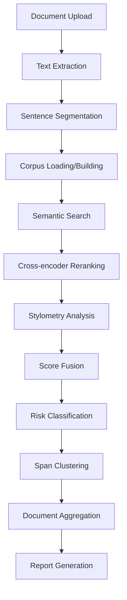

# DocInsight Technical Documentation

## Table of Contents
1. [System Overview](#system-overview)
2. [Architecture & Components](#architecture--components)
3. [Tech Stack & Dependencies](#tech-stack--dependencies)
4. [Machine Learning Models](#machine-learning-models)
5. [Core Algorithms & Flow](#core-algorithms--flow)
6. [Data Processing Pipeline](#data-processing-pipeline)
7. [Scoring & Classification](#scoring--classification)
8. [Configuration & Environment](#configuration--environment)
9. [Deployment & Containerization](#deployment--containerization)
10. [API & Integration](#api--integration)

---

## System Overview

**DocInsight** is an advanced document originality analysis and plagiarism detection system that employs multi-layered AI techniques to assess document authenticity. The system combines semantic similarity detection, cross-encoder reranking, stylometric analysis, and document-level aggregation to provide comprehensive plagiarism risk assessment.

### Key Capabilities
- **Multi-format Support**: PDF, DOCX, TXT document processing
- **Semantic Analysis**: Deep learning-based semantic similarity detection
- **Stylometric Profiling**: Writing style analysis and comparison
- **Academic Focus**: Specialized for academic document assessment
- **Real-time Analysis**: Interactive web interface for instant analysis
- **Comprehensive Reporting**: HTML and JSON export capabilities

---

## Architecture & Components

### High-Level Architecture

```
┌─────────────────┐    ┌──────────────────┐    ┌─────────────────┐
│   Streamlit UI  │    │ Enhanced Pipeline│    │ Scoring Engine  │
│                 │───▶│                  │───▶│                 │
│ - File Upload   │    │ - Text Extract   │    │ - Sentence Cls  │
│ - Metrics View  │    │ - Preprocessing  │    │ - Span Cluster  │
│ - Risk Spans    │    │ - Multi-analysis │    │ - Doc Scoring   │
└─────────────────┘    └──────────────────┘    └─────────────────┘
                                │
                       ┌────────▼────────┐
                       │ ML Components   │
                       │                 │
                       │ - SBERT Search  │
                       │ - Cross Encoder │
                       │ - Stylometry    │
                       │ - FAISS Index   │
                       └─────────────────┘
```

### Core Components

#### 1. **DocumentAnalysisPipeline** (`enhanced_pipeline.py`)
- **Purpose**: Main orchestrator for document processing
- **Key Functions**:
  - Document text extraction
  - Sentence segmentation
  - Multi-modal analysis coordination
  - Report generation

#### 2. **TextExtractor** 
- **Purpose**: Document format handling and text extraction
- **Supported Formats**: 
  - PDF (via PyMuPDF/fitz)
  - DOCX (via docx2txt)
  - TXT (direct file reading)
- **Features**: Error handling, encoding detection

#### 3. **SemanticSearchEngine**
- **Purpose**: Semantic similarity detection using transformer models
- **Features**:
  - FAISS-based vector search (with numpy fallback)
  - Corpus indexing and management
  - Cosine similarity computation
- **Models**: Sentence-BERT (all-MiniLM-L6-v2)

#### 4. **CrossEncoderReranker**
- **Purpose**: High-precision candidate reranking
- **Model**: MS-Marco MiniLM cross-encoder
- **Function**: Refines initial semantic matches with bidirectional encoding

#### 5. **StylemetryAnalyzer**
- **Purpose**: Writing style analysis and comparison
- **Features**:
  - Readability metrics (Flesch Reading Ease)
  - Token statistics (word length, TTR)
  - POS tag analysis
  - Punctuation density
- **Dependencies**: spaCy, textstat

#### 6. **SentenceClassifier** (`scoring/core.py`)
- **Purpose**: Multi-signal fusion and risk classification
- **Algorithm**: Weighted combination of semantic, cross-encoder, and stylometric scores
- **Output**: Risk levels (HIGH/MEDIUM/LOW) with confidence scores

#### 7. **CorpusIndex** (`corpus_builder.py`)
- **Purpose**: Reference corpus management
- **Features**:
  - Academic corpus building
  - Domain adaptation support
  - Caching and persistence

---

## Tech Stack & Dependencies

### Core Technologies

#### **Backend Framework**
- **Python 3.10+**: Core runtime environment
- **Streamlit**: Web application framework and UI
- **Docker**: Containerization platform

#### **Machine Learning & NLP**
- **Sentence Transformers**: Semantic embeddings and similarity
- **Transformers (Hugging Face)**: Model backend and utilities
- **PyTorch**: Deep learning framework
- **spaCy**: Natural language processing pipeline
- **NLTK**: Text processing and tokenization
- **scikit-learn**: Machine learning utilities

#### **Vector Search & Indexing**
- **FAISS**: Facebook AI Similarity Search (primary)
- **NumPy**: Fallback similarity computation
- **Index Management**: Custom index lifecycle management

#### **Document Processing**
- **PyMuPDF (fitz)**: PDF text extraction
- **docx2txt**: Microsoft Word document processing
- **textstat**: Readability and text statistics

#### **Data & Storage**
- **JSON**: Configuration and data serialization
- **SQLite**: Database backend (Phase 2)
- **Pickle**: Object serialization for caching

### Dependencies Overview

```python
# Core ML Dependencies
sentence-transformers>=2.2.2    # Semantic embeddings
transformers>=4.33.2            # Model backend
torch>=2.0.0                    # Deep learning framework
faiss-cpu>=1.8.0               # Vector similarity search
scikit-learn>=1.3.0            # ML utilities

# NLP Processing
spacy>=3.6.0                   # Language processing
nltk==3.8.1                   # Text tokenization
textstat==0.7.3               # Readability metrics

# Document Processing
docx2txt==0.8                 # Word document extraction
PyMuPDF==1.23.5              # PDF text extraction

# Web Framework
streamlit>=1.25.0             # Web interface

# Utilities
numpy>=1.21.0                 # Numerical computing
pandas>=1.5.0                 # Data manipulation
tqdm>=4.64.0                  # Progress bars
```

---

## Machine Learning Models

### 1. **Semantic Similarity Model**

**Model**: `sentence-transformers/all-MiniLM-L6-v2`
- **Type**: Sentence-BERT (Bi-encoder)
- **Embedding Dimension**: 384
- **Purpose**: Generate semantic embeddings for similarity comparison
- **Training**: Pre-trained on 1B+ sentence pairs
- **Performance**: Balanced speed/accuracy for semantic search

**Usage in System**:
```python
# Model loading and encoding
model = SentenceTransformer('all-MiniLM-L6-v2')
embeddings = model.encode(sentences, convert_to_numpy=True)
```

### 2. **Cross-Encoder Reranking Model**

**Model**: `cross-encoder/ms-marco-MiniLM-L-6-v2`
- **Type**: Cross-encoder (Bidirectional)
- **Purpose**: Rerank semantic search candidates for higher precision
- **Training**: MS-MARCO passage ranking dataset
- **Architecture**: BERT-based with classification head

**Usage in System**:
```python
# Cross-encoder reranking
cross_encoder = CrossEncoder('cross-encoder/ms-marco-MiniLM-L-6-v2')
scores = cross_encoder.predict([[query, candidate] for candidate in candidates])
```

### 3. **Stylometry Analysis**

**Model**: `spaCy en_core_web_sm`
- **Type**: Multi-task CNN for NLP
- **Purpose**: Linguistic feature extraction
- **Components**: 
  - Tokenization
  - POS tagging
  - Named entity recognition
  - Dependency parsing

**Features Extracted**:
- Flesch Reading Ease score
- Average word length
- Type-token ratio (TTR)
- Punctuation density
- POS tag distributions

### 4. **Fine-tuning Support** (Phase 2)

**Custom Model Path**: `models/semantic_local/`
- **Purpose**: Domain-specific fine-tuning for academic content
- **Training Data**: PAWS, Quora question pairs, academic paraphrases
- **Configuration**: Controllable via environment variables

---

## Core Algorithms & Flow

### Document Processing Flow



### 1. **Text Extraction & Preprocessing**

```python
# Document processing pipeline
def analyze_document(file_path: str):
    # Extract text based on file format
    text = TextExtractor.extract_text(file_path)
    
    # Segment into sentences
    sentences = SentenceProcessor.split_sentences(text)
    
    # Filter short sentences (< MIN_SENTENCE_LENGTH)
    sentences = [s for s in sentences if len(s.strip()) > MIN_SENTENCE_LENGTH]
    
    return sentences
```

### 2. **Semantic Similarity Detection**

```python
# Semantic search process
def search_similar(query: str, top_k: int = 5):
    # Generate query embedding
    query_embedding = sbert_model.encode([query])
    
    # Normalize for cosine similarity
    query_embedding = query_embedding / np.linalg.norm(query_embedding)
    
    # FAISS similarity search
    scores, indices = faiss_index.search(query_embedding, top_k)
    
    # Return candidates with scores
    return [{'sentence': corpus[idx], 'score': score} 
            for score, idx in zip(scores[0], indices[0])]
```

### 3. **Multi-Modal Score Fusion**

```python
# Fusion algorithm
def compute_fused_score(semantic_results, rerank_results, stylometry_features):
    # Normalize each score type to [0,1]
    semantic_norm = normalize_scores([r['score'] for r in semantic_results])
    rerank_norm = normalize_scores([r['rerank_score'] for r in rerank_results])
    
    # Compute stylometry similarity
    stylo_sim = compute_stylometry_similarity(query_features, candidate_features)
    
    # Weighted fusion
    fused_score = (
        FUSION_WEIGHTS['semantic'] * semantic_norm +
        FUSION_WEIGHTS['cross_encoder'] * rerank_norm +
        FUSION_WEIGHTS['stylometry'] * stylo_sim
    )
    
    return fused_score
```

### 4. **Risk Classification with Gating**

```python
# Risk classification with semantic floors
def classify_sentence(fused_score, semantic_norm, semantic_raw):
    # Semantic minimum threshold
    if semantic_raw < SEMANTIC_MIN_MATCH:
        return 'LOW', 'Semantic raw score too low'
    
    # High risk gating (requires both conditions)
    if (fused_score >= HIGH_RISK_THRESHOLD and 
        semantic_norm >= SEMANTIC_HIGH_FLOOR):
        return 'HIGH', 'High similarity detected'
    
    # Medium risk gating
    if (fused_score >= MEDIUM_RISK_THRESHOLD and 
        semantic_norm >= SEMANTIC_MEDIUM_FLOOR):
        return 'MEDIUM', 'Moderate similarity detected'
    
    return 'LOW', 'Below risk thresholds'
```

### 5. **Document-Level Aggregation**

```python
# Document scoring algorithm
def compute_originality_score(sentence_results, risk_spans):
    # Coverage: token-weighted plagiarized portion
    total_tokens = sum(len(s['sentence'].split()) for s in sentence_results)
    plagiarized_tokens = sum(span['token_count'] for span in risk_spans)
    coverage = plagiarized_tokens / total_tokens
    
    # Severity: average risk scores of plagiarized spans
    severity_scores = [span['avg_score'] for span in risk_spans]
    severity = np.mean(severity_scores) if severity_scores else 0.0
    
    # Span ratio: proportion of sentences in risk spans
    span_ratio = len(risk_spans) / len(sentence_results)
    
    # Weighted aggregation
    plagiarism_factor = (
        AGGREGATION_WEIGHTS['alpha'] * coverage +
        AGGREGATION_WEIGHTS['beta'] * severity +
        AGGREGATION_WEIGHTS['gamma'] * span_ratio
    )
    
    # Originality score
    originality_score = max(0.0, 1.0 - plagiarism_factor)
    
    return {
        'originality_score': originality_score,
        'plagiarized_coverage': coverage,
        'severity_index': severity,
        'risk_span_ratio': span_ratio,
        'plagiarism_factor': plagiarism_factor
    }
```

---

## Data Processing Pipeline

### Input Processing

1. **File Upload Handling**
   - Multi-format support (PDF, DOCX, TXT)
   - File validation and security checks
   - Temporary file management

2. **Text Extraction**
   - Format-specific extraction engines
   - Encoding detection and handling
   - Error recovery and fallback

3. **Preprocessing**
   - Sentence boundary detection
   - Minimum length filtering
   - Citation masking (optional)
   - Text normalization

### Analysis Pipeline

1. **Corpus Preparation**
   - Demo corpus loading (15 base sentences)
   - Extended corpus generation (20,000+ sentences)
   - Academic domain adaptation
   - Index building and caching

2. **Sentence-Level Analysis**
   - Semantic embedding generation
   - Similarity search execution
   - Cross-encoder reranking
   - Stylometric feature extraction
   - Multi-modal score fusion

3. **Document-Level Processing**
   - Risk span identification
   - Consecutive sentence clustering
   - Repeated match decay
   - Aggregate scoring

### Output Generation

1. **Metrics Computation**
   - Originality score calculation
   - Risk distribution analysis
   - Component breakdown
   - Statistical summaries

2. **Report Generation**
   - Interactive web interface
   - HTML report export
   - JSON data export
   - Visualization components

---

## Scoring & Classification

### Multi-Level Scoring System

#### **Level 1: Component Scores**

**Semantic Similarity**
- **Range**: [0, 1] (cosine similarity)
- **Computation**: Dot product of normalized embeddings
- **Purpose**: Core semantic content matching

**Cross-Encoder Score**
- **Range**: Varies (model-dependent)
- **Computation**: Bidirectional attention over query-candidate pairs
- **Purpose**: High-precision similarity refinement

**Stylometric Similarity**
- **Range**: [0, 1]
- **Computation**: 1 - |flesch_query - flesch_candidate| / normalization_factor
- **Purpose**: Writing style consistency measurement

#### **Level 2: Fused Score**

**Fusion Formula**:
```
fused_score = α × semantic_norm + β × cross_encoder_norm + γ × stylometry_score

Where:
α = 0.6 (semantic weight)
β = 0.3 (cross-encoder weight)  
γ = 0.1 (stylometry weight)
```

**Normalization**: Each component is normalized to [0,1] within candidate set

#### **Level 3: Risk Classification**

**Classification Rules**:
```python
if semantic_raw < 0.35:
    risk = LOW  # Minimum evidence guard

elif fused_score >= 0.7 and semantic_norm >= 0.6:
    risk = HIGH  # Strong evidence + semantic confirmation

elif fused_score >= 0.4 and semantic_norm >= 0.4:
    risk = MEDIUM  # Moderate evidence + semantic confirmation

else:
    risk = LOW  # Insufficient evidence
```

**Match Strength Labels**:
- **STRONG**: semantic_norm ≥ 0.75
- **MODERATE**: semantic_norm ≥ 0.55
- **WEAK**: semantic_norm ≥ 0.40
- **VERY_WEAK**: semantic_norm < 0.40

#### **Level 4: Document Aggregation**

**Aggregation Formula**:
```
plagiarism_factor = α × coverage + β × severity + γ × span_ratio

originality_score = max(0, 1 - plagiarism_factor)

Where:
α = 0.55 (coverage weight)
β = 0.30 (severity weight)
γ = 0.15 (span ratio weight)
```

**Components**:
- **Coverage**: Token-weighted proportion of plagiarized content
- **Severity**: Average confidence of risk spans
- **Span Ratio**: Proportion of sentences forming risk spans

---

## Configuration & Environment

### Core Configuration (`config.py`)

#### **Model Settings**
```python
SBERT_MODEL_NAME = 'all-MiniLM-L6-v2'
CROSS_ENCODER_MODEL_NAME = 'cross-encoder/ms-marco-MiniLM-L-6-v2'
SPACY_MODEL_NAME = 'en_core_web_sm'
```

#### **Scoring Thresholds**
```python
HIGH_RISK_THRESHOLD = 0.7
MEDIUM_RISK_THRESHOLD = 0.4
SEMANTIC_HIGH_FLOOR = 0.60
SEMANTIC_MEDIUM_FLOOR = 0.40
SEMANTIC_MIN_MATCH = 0.35
```

#### **Fusion Weights**
```python
FUSION_WEIGHTS = {
    'semantic': 0.6,
    'cross_encoder': 0.3,
    'stylometry': 0.1
}

AGGREGATION_WEIGHTS = {
    'alpha': 0.55,  # Coverage
    'beta': 0.30,   # Severity
    'gamma': 0.15   # Span ratio
}
```

### Environment Variables

#### **Model Configuration**
```bash
DOCINSIGHT_USE_FINE_TUNED=true          # Use fine-tuned model if available
DOCINSIGHT_FORCE_RETRAIN=false          # Force model retraining
DOCINSIGHT_EXTENDED_CORPUS=true         # Use extended demo corpus
```

#### **Processing Settings**
```bash
DOCINSIGHT_CITATION_MASKING_ENABLED=true    # Enable citation masking
DOCINSIGHT_CHUNK_SIZE=512                   # Processing chunk size
DOCINSIGHT_OVERLAP=50                       # Chunk overlap
```

#### **Scoring Weights** (Runtime Overrides)
```bash
DOCINSIGHT_W_SEMANTIC=0.6                   # Semantic weight
DOCINSIGHT_W_STYLO=0.25                     # Stylometry weight
DOCINSIGHT_W_AI=0.15                        # AI-likeness weight
```

#### **Advanced Features**
```bash
DOCINSIGHT_REUSE_ALLOWANCE=2                # Repeated match allowance
DOCINSIGHT_REUSE_DECAY=0.85                 # Decay factor for repeated matches
DOCINSIGHT_AI_THRESHOLD=0.7                 # AI-likeness threshold
```

---

## Deployment & Containerization

### Docker Architecture

#### **Base Image**: `python:3.10-slim`
- Lightweight Python runtime
- Debian-based for package compatibility
- Optimized for production deployment

#### **Container Structure**
```dockerfile
FROM python:3.10-slim

WORKDIR /app

# System dependencies
RUN apt-get update && apt-get install -y \
    build-essential python3-dev libffi-dev libssl-dev git

# Python dependencies
COPY requirements.txt .
RUN pip install --no-cache-dir -r requirements.txt

# Model downloads
RUN python -m spacy download en_core_web_sm
RUN python -c "import nltk; nltk.download('punkt'); nltk.download('punkt_tab')"

# Application code
COPY . .
RUN chmod +x ./entrypoint.sh

EXPOSE 8501
ENTRYPOINT ["./entrypoint.sh"]
```

#### **Entrypoint Process**
```bash
#!/usr/bin/env bash
# Prevent segmentation faults
python3 -c "import multiprocessing; multiprocessing.set_start_method('forkserver', force=True)"

# Setup process
if [ ! -f "corpus_cache/.docinsight_academic_ready" ]; then
    python3 setup_docinsight.py --target-size 20000
fi

# Launch application
streamlit run streamlit_app.py --server.port 8501 --server.address 0.0.0.0
```

### Deployment Commands

#### **Build Image**
```bash
docker build -t docinsight:latest .
```

#### **Run Container**
```bash
docker run -d -p 8501:8501 --name docinsight-app docinsight:latest
```

#### **Development Mode**
```bash
docker run -it -p 8501:8501 -v $(pwd):/app docinsight:latest bash
```

### Production Considerations

1. **Resource Requirements**
   - **Memory**: 4GB+ recommended (for model loading)
   - **CPU**: 2+ cores (for concurrent processing)
   - **Storage**: 2GB+ for models and cache

2. **Scaling**
   - Stateless application design
   - Corpus caching for performance
   - Model loading optimization

3. **Security**
   - File upload validation
   - Resource limits
   - Network isolation

---

## API & Integration

### Web Interface API

#### **Streamlit Application** (`streamlit_app.py`)

**Core Routes**:
- **File Upload**: Multi-format document upload interface
- **Analysis Display**: Real-time originality metrics
- **Risk Visualization**: Interactive risk span exploration
- **Report Export**: HTML/JSON download capabilities

#### **Key Functions**

**Document Processing**:
```python
def process_document(uploaded_file):
    """Process uploaded document and return analysis results"""
    # Save to temporary file
    with tempfile.NamedTemporaryFile(delete=False, suffix=file_ext) as tmp_file:
        tmp_file.write(uploaded_file.getvalue())
        temp_path = tmp_file.name
    
    # Analyze document
    pipeline = DocumentAnalysisPipeline()
    results = pipeline.analyze_document(temp_path)
    
    return results
```

**Metrics Display**:
```python
def display_originality_metrics(metrics):
    """Display document-level originality metrics"""
    col1, col2, col3, col4, col5 = st.columns(5)
    
    with col1:
        st.metric("Originality Score", f"{metrics['originality_score']:.1%}")
    with col2:
        st.metric("Plag. Coverage", f"{metrics['plagiarized_coverage']:.1%}")
    # ... additional metrics
```

### Programmatic API

#### **Core Pipeline Access**
```python
from enhanced_pipeline import DocumentAnalysisPipeline

# Initialize pipeline
pipeline = DocumentAnalysisPipeline()

# Analyze document
result = pipeline.analyze_document('document.pdf')

# Access metrics
metrics = result['originality_analysis']['originality_metrics']
print(f"Originality Score: {metrics['originality_score']:.1%}")
```

#### **Component-Level Access**
```python
from enhanced_pipeline import SemanticSearchEngine, CrossEncoderReranker
from scoring.core import SentenceClassifier

# Individual component usage
semantic_engine = SemanticSearchEngine()
reranker = CrossEncoderReranker()
classifier = SentenceClassifier()

# Custom analysis pipeline
candidates = semantic_engine.search_similar(query, top_k=5)
reranked = reranker.rerank(query, [c['sentence'] for c in candidates])
classification = classifier.classify_sentence(query, candidates, stylometry_features)
```

### Integration Points

#### **Database Integration** (Phase 2)
```python
from db import DatabaseManager

# Document ingestion
db_manager = DatabaseManager()
doc_id = db_manager.ingest_document(file_path, metadata)

# Corpus management
chunks = db_manager.get_document_chunks(doc_id)
embeddings = embedding_processor.generate_embeddings(chunks)
```

#### **Custom Corpus Integration**
```python
# Custom corpus usage
custom_corpus = ["Custom sentence 1", "Custom sentence 2", ...]
pipeline = DocumentAnalysisPipeline(corpus_sentences=custom_corpus)
results = pipeline.analyze_document(document_path)
```

#### **Batch Processing**
```python
# Batch document analysis
def analyze_batch(file_paths):
    pipeline = DocumentAnalysisPipeline()
    results = []
    
    for file_path in file_paths:
        try:
            result = pipeline.analyze_document(file_path)
            results.append({
                'file': file_path,
                'status': 'success',
                'analysis': result
            })
        except Exception as e:
            results.append({
                'file': file_path,
                'status': 'error',
                'error': str(e)
            })
    
    return results
```

---

## Advanced Features

### Citation Masking

**Purpose**: Remove citation artifacts before analysis to avoid false similarity spikes

**Implementation**:
```python
CITATION_PATTERNS = {
    'numeric': [r'\[\d+\]', r'\(\d+\)', r'\d+\s*\)'],
    'author_year': [r'\([A-Za-z]+\s*et\s*al\.?\s*,?\s*\d{4}\)'],
    'footnote': [r'\d+\s*\)', r'^\d+\s']
}

def mask_citations(text):
    """Mask citation patterns in text"""
    for pattern_type, patterns in CITATION_PATTERNS.items():
        for pattern in patterns:
            text = re.sub(pattern, '[CITATION]', text)
    return text
```

### Repeated Match Decay

**Purpose**: Penalize overuse of the same corpus sentence to reduce generic-sentence inflation

**Algorithm**:
```python
def apply_reuse_decay(sentence_results):
    """Apply decay to repeated corpus matches"""
    match_counts = {}
    
    for result in sentence_results:
        best_match = result.get('best_match', '')
        if best_match:
            match_counts[best_match] = match_counts.get(best_match, 0) + 1
            occurrence = match_counts[best_match]
            
            if occurrence > REUSE_DECAY_ALLOWANCE:
                # Apply decay
                extra = occurrence - REUSE_DECAY_ALLOWANCE
                multiplier = REUSE_DECAY_FACTOR ** extra
                result['confidence_score'] *= multiplier
                result['fused_score'] *= multiplier
                
                # Potentially downgrade risk level
                # ... risk downgrading logic
```

### Fine-tuning Support

**Domain Adaptation**:
```python
# Fine-tuning configuration
FINE_TUNING_CONFIG = {
    'epochs': 3,
    'batch_size': 16,
    'learning_rate': 2e-5,
    'model_path': 'models/semantic_local/'
}

# Training data sources
TRAINING_SOURCES = [
    'PAWS paraphrase dataset',
    'Quora question pairs',
    'Academic Wikipedia articles',
    'arXiv research abstracts',
    'Synthetic academic paraphrases'
]
```

---

This technical documentation provides a comprehensive overview of the DocInsight system architecture, implementation details, and operational characteristics. The system represents a sophisticated approach to document originality analysis, combining multiple AI techniques for robust and accurate plagiarism detection.